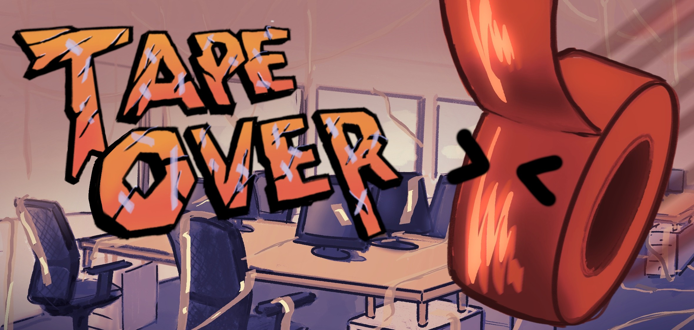

# Tapeover

Play the game at https://woodenpillowgames.itch.io/tape-over

Roll, stick, and tumble your way through chaotic challenges as a living roll of duct tape! Master quirky physics, improvise solutions, and discover just how versatile tape can be.

FEATURES

Chaotic Physics Platforming!
Roll, swing, and cling as a living roll of duct tape. Every move feels risky, every mistake costly. Master the absurd physics and survive rage-inducing obstacles.

Cutting-Edge Hazards!
Beware of blades, waiting to slice you loose. One wrong swing and your sticky lifeline is gone.

Limited Tape, Unlimited Rage!
Your tape supply is finite waste it and fail before reaching the goal. Every inch counts, every decision matters.

Spider-Tape Traversal!
Swing across gaps, climb walls, and improvise crazy routes like a duct-taped Spider-Man. Success feels amazing… failure feels devastating.

Handcrafted Rage Levels!
Levels are built to frustrate and challenge. Precision swings, vertical climbs, and “one slip = restart” moments guarantee salt, sweat, and laughter.
EARLY DEVELOPMENT

This is an early prototype expect bugs, weird physics, and plenty of rough edges (literally). We currently have a handful of mechanics and levels, but our vision is to expand into dozens of brutal challenges with new hazards and tape-based tricks.

We’re a small indie team pouring everything we’ve got into making the most absurd, infuriating, and oddly satisfying duct tape game you’ve ever played.
DISCLAIMER

If you enjoy what you see, here’s how you can help us:

    Play the build and share your rage moments in the comments.

    Tell your friends (and enemies) about the duct tape nightmare.
    Give us feedback and feel free to reach us out: woodenpillowgames@gmail.com

CREDITS

  - Programmer: Mustafa Kaan Güngör
  - 2D Artist: Dicle Şahindokuyucu
  - 3D Artist: Berk Vurat
  - Game Designer: Furkan Palabıyık
